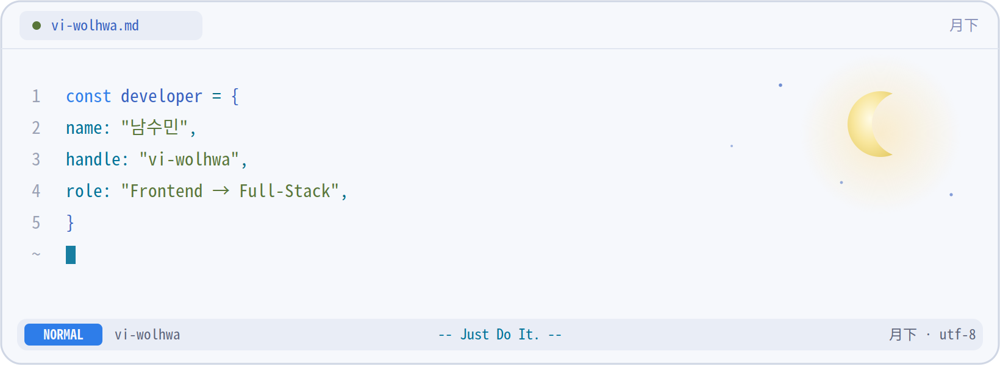
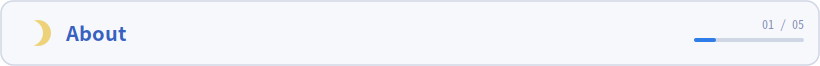
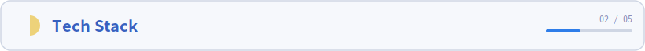
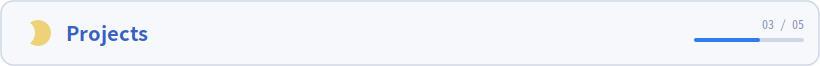
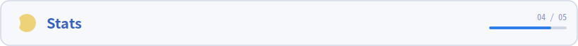
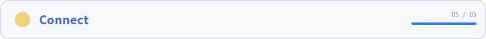
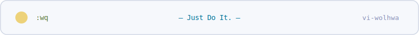

 

<!-- ========================= TYPING ========================= -->

  <picture>
    <source media="(prefers-color-scheme: dark)" srcset="https://readme-typing-svg.demolab.com?font=Gowun+Dodum&size=28&duration=3500&pause=900&color=7AA2F7&center=true&vCenter=true&width=720&height=50&lines=%EC%95%88%EB%85%95%ED%95%98%EC%84%B8%EC%9A%94%2C+FE+%EA%B0%9C%EB%B0%9C%EC%9E%90+%EB%82%A8%EC%88%98%EB%AF%BC%EC%9E%85%EB%8B%88%EB%8B%A4.;%EC%B6%9C%EB%B0%9C%EC%9D%B4+%EB%8A%A6%EC%97%88%EB%8B%A4%EB%A9%B4%2C+%EB%8D%94+%EC%97%B4%EC%8B%AC%ED%9E%88+%EB%8B%AC%EB%A6%AC%EB%A9%B4+%EB%8F%BC.;%EC%B2%9C%EC%B2%9C%ED%9E%88%2C+%EA%BE%B8%EC%A4%80%ED%9E%88%2C+Just+Do+It%21" />
    
  </picture>

 

<!-- ========================= HERO ========================= -->

  <picture>
    <source media="(prefers-color-scheme: dark)" srcset="./assets/hero-night.png" />
    
  </picture>

 

<!-- ===================== visitor + followers ===================== -->

  
  &nbsp;
  

 
 

<!-- ===================== 01 · ABOUT 🌒 ===================== -->
<picture>
  <source media="(prefers-color-scheme: dark)" srcset="./assets/sec1-night.svg" />
  
</picture>

 
 

&nbsp; &nbsp; &nbsp; &nbsp; 개발하고 싶은 것들이 너무나 많은 프론트엔드 개발자입니다.  
&nbsp; &nbsp; &nbsp; &nbsp; &nbsp; &nbsp; 우아한테크코스와 카카오페이증권에서 FE 역량을 쌓았습니다.  
&nbsp; &nbsp; &nbsp; &nbsp; &nbsp; &nbsp; &nbsp; &nbsp; 현재는 FE 개발자 취업을 준비하고 있습니다.  

&nbsp; &nbsp; &nbsp; &nbsp; 인턴 이후, 취업을 준비하는 동안 방황하는 시간이 길었지만,  
&nbsp; &nbsp; &nbsp; &nbsp; &nbsp; &nbsp; 저의 커리어 목표를 찾은 이후, 더 열심히 Step Up 중입니다.  

&nbsp; &nbsp; &nbsp; &nbsp; 현재 세 가지 프로젝트를 진행하고 있습니다. 
&nbsp; &nbsp; &nbsp; &nbsp; &nbsp; &nbsp; 나만의 개발 생태계를 구축하는 `AudeModo`, 
&nbsp; &nbsp; &nbsp; &nbsp; &nbsp; &nbsp; &nbsp; &nbsp; FE 역량 성장을 위하여 멘토님과 함께하는 `Evenly`, 
&nbsp; &nbsp; &nbsp; &nbsp; &nbsp; &nbsp; &nbsp; &nbsp; &nbsp; &nbsp; 반응형 렌더링 패키지 `@audemono/responsive-keepalive`

&nbsp; &nbsp; &nbsp; &nbsp; 최근에는 오래 전부터 관심이 있었던 Spring를 공부하고 있습니다. 
&nbsp; &nbsp; &nbsp; &nbsp; &nbsp; &nbsp; 하고 싶은 것들에 비해 할 수 있는 시간은 그리 많지 않지만, 
&nbsp; &nbsp; &nbsp; &nbsp; &nbsp; &nbsp; &nbsp; &nbsp; 천천히, 꾸준히, 목표를 향해 정진합니다. 

&nbsp; &nbsp; &nbsp; &nbsp; Just Do It! 

 
 

<!-- ===================== 02 · TECH STACK 🌓 ===================== -->
<picture>
  <source media="(prefers-color-scheme: dark)" srcset="./assets/sec2-night.svg" />
  
</picture>

 
 

  <picture>
    <source media="(prefers-color-scheme: dark)" srcset="https://skillicons.dev/icons?i=html,js,react,tailwind,java,git,figma,css,ts,nextjs,sass,spring,github,notion&theme=dark&perline=7" />
    
  </picture>
    
  🌱 &nbsp;<b>Currently Learning</b> &nbsp;·&nbsp; Java &nbsp;·&nbsp; Spring Boot

 
 

<!-- ===================== 03 · PROJECTS 🌔 ===================== -->
<picture>
  <source media="(prefers-color-scheme: dark)" srcset="./assets/sec3-night.svg" />
  
</picture>

 

#### &nbsp;&nbsp;&nbsp;&nbsp; 🌐 AudeModo ([Repo](https://github.com/AudeModo))  
&nbsp;&nbsp;&nbsp;&nbsp;&nbsp;&nbsp;&nbsp; • 소개 : 앱을 계속 쌓아올리는 프론트엔드 플랫폼 생태계 ([role-model](https://github.com/HoBom-s)) 
&nbsp;&nbsp;&nbsp;&nbsp;&nbsp;&nbsp;&nbsp; • 기간 : 2026.06. ~ 2099.01.01  
&nbsp;&nbsp;&nbsp;&nbsp;&nbsp;&nbsp;&nbsp; • 목적 : 나만의 생태계 구축 (아키텍처 설계, edge·BFF·서버 소유, 멀티 앱 통합 등)  

#### &nbsp;&nbsp;&nbsp;&nbsp; 💰 Evenly ([Repo](https://github.com/EvenlyTeam/evenly-frontend))  
&nbsp;&nbsp;&nbsp;&nbsp;&nbsp;&nbsp;&nbsp; • 소개 : 더치페이·모임 정산기  
&nbsp;&nbsp;&nbsp;&nbsp;&nbsp;&nbsp;&nbsp; • 기간 : 2026.06. ~ (Continue..)  
&nbsp;&nbsp;&nbsp;&nbsp;&nbsp;&nbsp;&nbsp; • 목적 : FE 역량 향상 (동적 폼 상태 관리, 인증 상태 관리, 정산 결과 시각화 등)  

#### &nbsp;&nbsp;&nbsp;&nbsp; 🖼️ @audemodo/responsive-keepalive ([Repo](https://github.com/AudeModo/audemodo-responsive-keepalive))  
&nbsp;&nbsp;&nbsp;&nbsp;&nbsp;&nbsp;&nbsp; • 소개 : breakpoint마다 구조가 다른 레이아웃을 상태 손실 없이 전환하는 React 라이브러리  
&nbsp;&nbsp;&nbsp;&nbsp;&nbsp;&nbsp;&nbsp; • 기간 : 2026.06. ~ 현재(v0.1.0(beta) 배포 완료, Issue 수렴 중)  
&nbsp;&nbsp;&nbsp;&nbsp;&nbsp;&nbsp;&nbsp; • 목적 : 오픈소스 npm 패키지 설계·배포 (React 19.2 Activity 상태 보존, ESM·CJS 듀얼 빌드, SSR·하이드레이션 대응 등)  

 
 

<!-- ===================== 04 · STATS 🌖 ===================== -->
<picture>
  <source media="(prefers-color-scheme: dark)" srcset="./assets/sec4-night.svg" />
  
</picture>

 
 

> [!IMPORTANT]
> *모든 프로젝트는 조직 레포를 통해 진행합니다. 조직 기여 표시 방법 찾는 중..*

 

  <picture>
    <source media="(prefers-color-scheme: dark)" srcset="https://github-readme-stats.vercel.app/api?username=vi-wolhwa&show_icons=true&include_all_commits=true&count_private=true&hide_border=true&title_color=7AA2F7&icon_color=7DCFFF&text_color=C0CAF5&bg_color=00000000" />
    
  </picture>
  <picture>
    <source media="(prefers-color-scheme: dark)" srcset="https://github-readme-stats.vercel.app/api/top-langs/?username=vi-wolhwa&layout=compact&hide_border=true&langs_count=8&title_color=7AA2F7&text_color=C0CAF5&bg_color=00000000" />
    
  </picture>

  <picture>
    <source media="(prefers-color-scheme: dark)" srcset="https://streak-stats.demolab.com?user=vi-wolhwa&hide_border=true&background=00000000&stroke=7AA2F7&ring=7AA2F7&fire=7DCFFF&currStreakNum=C0CAF5&sideNums=C0CAF5&currStreakLabel=7AA2F7&sideLabels=565F89&dates=565F89" />
    
  </picture>

  <picture>
    <source media="(prefers-color-scheme: dark)" srcset="https://github-profile-trophy.vercel.app/?username=vi-wolhwa&theme=tokyonight&no-frame=true&no-bg=true&margin-w=4&column=7" />
    
  </picture>

  <picture>
    <source media="(prefers-color-scheme: dark)" srcset="https://github-readme-activity-graph.vercel.app/graph?username=vi-wolhwa&bg_color=00000000&title_color=7AA2F7&color=C0CAF5&line=7AA2F7&point=7DCFFF&area=true&area_color=7AA2F7&hide_border=true" />
    
  </picture>

<!-- snake (requires the Generate Snake action to have run once) -->

  <picture>
    <source media="(prefers-color-scheme: dark)" srcset="https://raw.githubusercontent.com/vi-wolhwa/vi-wolhwa/output/github-contribution-grid-snake-dark.svg" />
    
  </picture>

 

<!-- ===================== 05 · CONNECT 🌕 ===================== -->
<picture>
  <source media="(prefers-color-scheme: dark)" srcset="./assets/sec5-night.svg" />
  
</picture>

 
 

  
  &nbsp;
  
  &nbsp;
  

 
 

<!-- ========================= FOOTER ========================= -->
<!-- 

  <picture>
    <source media="(prefers-color-scheme: dark)" srcset="./assets/footer-night.svg" />
    
  </picture>

 -->
